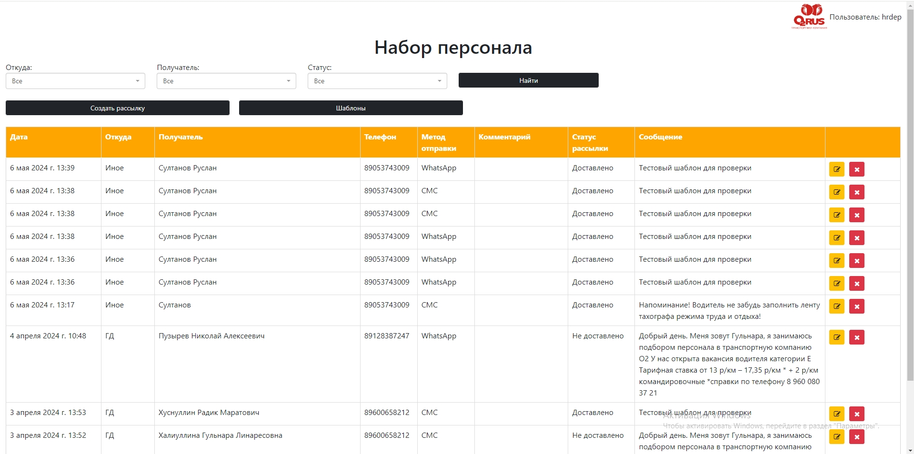

# Таблица регистрации входящих звонков

### Тестовое задание от Транспортной компании «О2RUS».

Транспортная компания «О2RUS» успешно работает на рынке транспортных услуг с
2005 года и имеет репутацию надежного партнера.

Наша миссия – оказание качественных услуг по организации автомобильных
грузоперевозок в комплексе с минимизацией затрат на логистику

**Цель задания:** необходимо сверстать таблицу, регистрации входящих и исходящих
звонков и добавить модальное окно с полями для ввода и выбора из выпадающего
списка для заполнения таблицы данными.

***Пример таблицы:***

